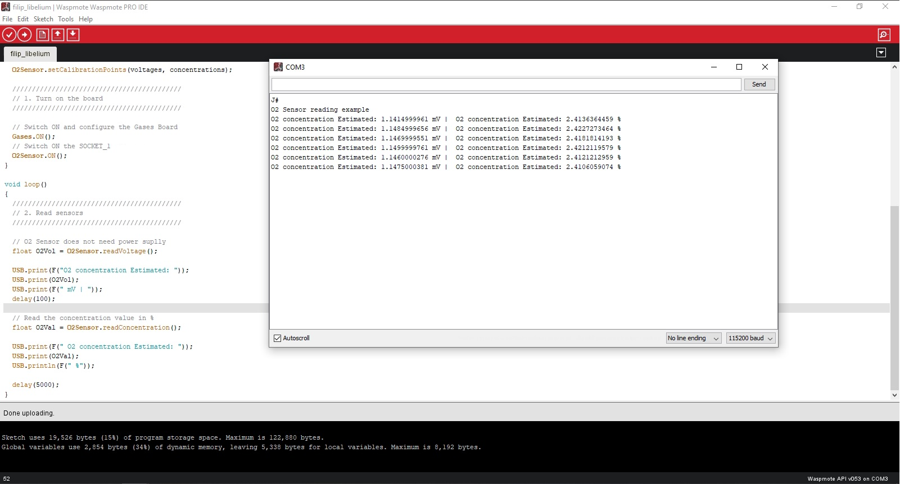

# Homework Filip Osiac


## Task
- Code for WiFi ESSID communication, manage to connect to LANCOMBEIA ESSID
- SET RTC time
- Read battery level
- Read temperature and Gas Concentration [gas sensors are on socket 1, on each of the boards]
- Read battery, temperature and Gas concentration and send via WiFI to meshlium
- Check that the data is sent on the MQTT broker [screenshot] - you can comment the screenshot picture in your gist code
- Build a Grafana Dashboard with the data received, add the link to grafana dashboard in gist comment

### Task1
The wifi module is illustrated in the figure below:

```
#include <WaspWIFI_PRO.h>
// We define the socket for wifi
uint8_t socket = SOCKET0;
// We put our credentials for our router
char ESSID[] = "************";
char PASSW[] = "************";
// define variables
uint8_t error;
uint8_t status;
unsigned long previous;

void setup() 
{
  USB.println(F("Start program"));  
  // 1. Switch ON the WiFi module
  error = WIFI_PRO.ON(socket);

  if (error == 0)
  {    
    USB.println(F("1. WiFi switched ON"));
  }
  else
  {
    USB.println(F("1. WiFi did not initialize correctly"));
  }

  // 2. Reset to default values
  error = WIFI_PRO.resetValues();

  if (error == 0)
  {    
    USB.println(F("2. WiFi reset to default"));
  }
  else
  {
    USB.println(F("2. WiFi reset to default ERROR"));
  }

  // 3. Set ESSID
  error = WIFI_PRO.setESSID(ESSID);

  if (error == 0)
  {    
    USB.println(F("3. WiFi set ESSID OK"));
  }
  else
  {
    USB.println(F("3. WiFi set ESSID ERROR"));
  }

  // 4. Set password key (It takes a while to generate the key)
  error = WIFI_PRO.setPassword(WPA2, PASSW);

  if (error == 0)
  {    
    USB.println(F("4. WiFi set AUTHKEY OK"));
  }
  else
  {
    USB.println(F("4. WiFi set AUTHKEY ERROR"));
  }

  // 5. Software Reset 
  error = WIFI_PRO.softReset();

  if (error == 0)
  {    
    USB.println(F("5. WiFi softReset OK"));
  }
  else
  {
    USB.println(F("5. WiFi softReset ERROR"));
  }

  USB.println(F("*******************************************"));
  USB.println(F("Once the module is configured with ESSID"));
  USB.println(F("and PASSWORD, the module will attempt to "));
  USB.println(F("join the specified Access Point on power up"));
  USB.println(F("*******************************************\n"));

  // get current time
  previous = millis();
}

void loop()
{ 
  // Check if module is connected
  if (WIFI_PRO.isConnected() == true)
  {    
    USB.print(F("WiFi is connected OK"));
    USB.print(F(" Time(ms):"));    
    USB.println(millis()-previous); 

    USB.println(F("\n** Program stops **"));
    while(1)
    {}
  }
  else
  {
    USB.print(F("WiFi is connected ERROR")); 
    USB.print(F(" Time(ms):"));    
    USB.println(millis()-previous);  
  }
}
```
I tested the code and it worked. In the figure below you can see this:


### Task2
More detailes about [RTC](https://forge.irstea.fr/attachments/download/2352/lw12_prog_rtc_v4-8_201506.pdf) 

Code for RTC 

```
void setup()
{
  // Open the USB connection
  USB.ON();
  USB.println(F("RTC_1 example"));

  // Powers RTC up, init I2C bus and read initial values
  USB.println(F("Init RTC"));
  RTC.ON();
  
  // Setting time [yy:mm:dd:dow:hh:mm:ss]
  RTC.setTime("13:01:11:06:12:33:00");
  USB.print(F("Setting time: "));
  USB.println(F("13:01:11:06:12:33:00"));
}

void loop()
{
  // Reading time
  USB.print(F("Time [Day of week, YY/MM/DD, hh:mm:ss]: "));
  USB.println(RTC.getTime());
  
  delay(1000); 
}
```

### Task3
Code for Battery level
```
char WARNING_MESSAGE[] =\
"\n-------------------------------------------------------------------\n"\
"WARNING: This example is suitable for rechargeable batteries only.\n"\
"Non-rechargeable batteries always show a plain discharge curve,\n"\
"so it is not possible to know how much power is left.\n"
"-------------------------------------------------------------------\n";
 
 
void setup()
{
  // Open the USB connection
  USB.ON();
  USB.println(F("PWR_4 example"));
  
  // show warning
  USB.println( WARNING_MESSAGE );
}

void loop()
{
  // Show the remaining battery level
  USB.print(F("Battery Level: "));
  USB.print(PWR.getBatteryLevel(),DEC);
  USB.print(F(" %"));
  
  // Show the battery Volts
  USB.print(F(" | Battery (Volts): "));
  USB.print(PWR.getBatteryVolts());
  USB.println(F(" V"));
  
  delay(5000);
}
```

### Task4
Read temperature and Gas Concentration [gas sensors are on socket 2, on each of the boards]

<b>Code for O2</b>
```
// Library include
#include <WaspSensorGas_v30.h>
#include <WaspFrame.h>

// O2 Sensor must be connected in SOCKET_1
O2SensorClass O2Sensor(SOCKET_1);

// Percentage values of Oxygen
#define POINT1_PERCENTAGE 0.0    
#define POINT2_PERCENTAGE 5.0  

// Calibration Voltage Obtained during calibration process (in mV)
#define POINT1_VOLTAGE 0.35
#define POINT2_VOLTAGE 2.0

float concentrations[] = {POINT1_PERCENTAGE, POINT2_PERCENTAGE};
float voltages[] =       {POINT1_VOLTAGE, POINT2_VOLTAGE};

char node_ID[] = "O2_example";

void setup() 
{ 
  // Configure the USB port
  USB.ON();
  USB.println(F("O2 Sensor reading example"));

  O2Sensor.setCalibrationPoints(voltages, concentrations);
   
  ///////////////////////////////////////////
  // 1. Turn on the board
  /////////////////////////////////////////// 
  
  // Switch ON and configure the Gases Board
  Gases.ON();  
  // Switch ON the SOCKET_1
  O2Sensor.ON();
}

void loop()
{
  ///////////////////////////////////////////
  // 2. Read sensors
  ///////////////////////////////////////////  

  // O2 Sensor does not need power suplly
  float O2Vol = O2Sensor.readVoltage();
  
  USB.print(F("O2 concentration Estimated: "));
  USB.print(O2Vol);
  USB.print(F(" mV | "));
  delay(100);

  // Read the concentration value in %
  float O2Val = O2Sensor.readConcentration();
  
  USB.print(F(" O2 concentration Estimated: "));
  USB.print(O2Val);
  USB.println(F(" %"));  

  delay(5000);   
}
```

<b>Code for Temperature, humidity and pressure</b>

```
#include <WaspSensorGas_v30.h>
#include <WaspFrame.h>

float temperature; // Stores the temperature in ºC
float humidity;	   // Stores the realitve humidity in %RH
float pressure;	   // Stores the pressure in Pa

char node_ID[] = "BME280_example";

void setup()
{
  USB.ON();
  USB.println(F("Temperature, Humidity an Pressure example"));
  // Set the Waspmote ID
  frame.setID(node_ID);  
  
  ///////////////////////////////////////////
  // 1. Turn on the board
  /////////////////////////////////////////// 
  
  // Switch ON and configure the Gases Board
  Gases.ON();
  delay(100);   
}

void loop()
{
  ///////////////////////////////////////////
  // 2. Read sensors
  ///////////////////////////////////////////  

  // Read enviromental variables
  temperature = Gases.getTemperature();
  humidity = Gases.getHumidity();
  pressure = Gases.getPressure();

  // Print of the results
  USB.print(F("Temperature: "));
  USB.print(temperature);
  USB.print(F(" Celsius Degrees |"));
  
  USB.print(F(" Humidity : "));
  USB.print(humidity);
  USB.print(F(" %RH"));

  USB.print(F(" Pressure : "));
  USB.print(pressure);
  USB.print(F(" Pa"));

  USB.println();
  
  delay(3000);
}
```


### Task5
Read battery, temperature and Gas concentration and send via WiFI to meshlium **.**.**.***
```
char node_ID[] = "Osiac_Filip_Emanuel";

char type[] = "http";
char host[] = "**.**.**.***";
char port[] = "80";

// Create new frame (ASCII)
frame.createFrame(ASCII, node_ID);
frame.addSensor(SENSOR_GASES_O2, O2Val); 
frame.addSensor(SENSOR_GASES_TC, temperature);
frame.addSensor(SENSOR_BAT, battery); 

WIFI_PRO.sendFrameToMeshlium(type, host, port, frame.buffer, frame.length);
```

### Task6
Check that the data is sent on the MQTT broker [screenshot] - you can comment the screenshot picture in your gist code


### Task7
Build a Grafana Dashboard with the data received, add the [link](https://grafana.beia-telemetrie.ro/d/xcWCQgy7z/filip-osiac-libelium?orgId=1&from=1648128182049&to=1648129982049&refresh=10s) to grafana dashboard in gist comment


## The full code can be accessed [here](./final.pde)

